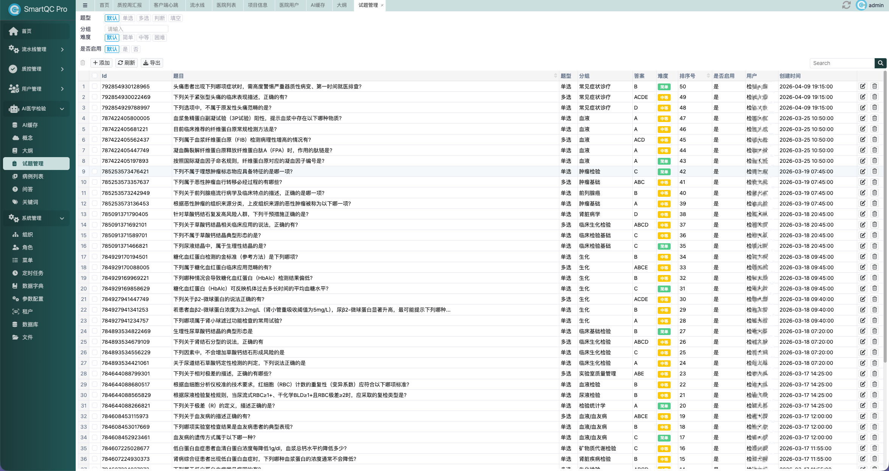
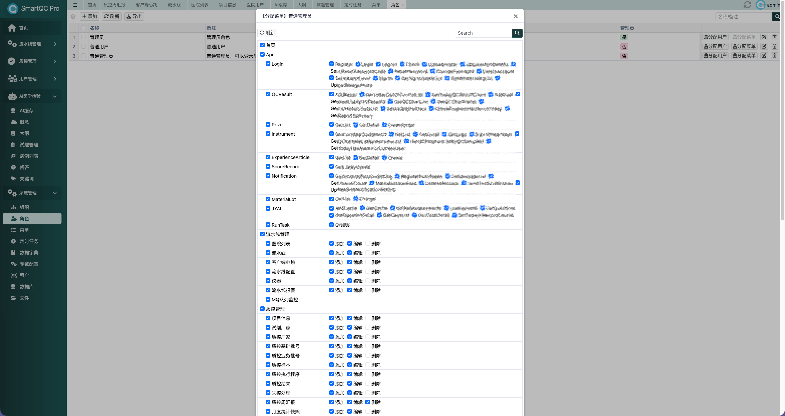
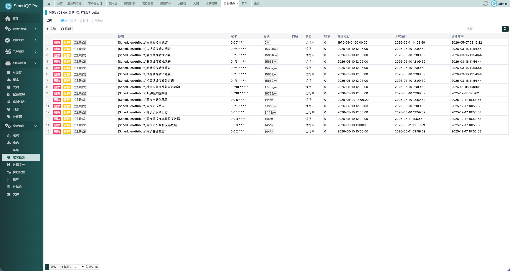

# NoAdmin

基于 **Blazor Server** 的后台管理与 SaaS 中台骨架：UI 使用 [BootstrapBlazor](https://www.blazor.zone/)，数据访问使用 [FreeSql](https://freesql.net/)，提供开箱即用的管理端基础能力与可扩展业务框架，具备前后端统一技术栈、组件化程度高、扩展性强、部署维护成本低等技术优势。

适合作为企业后台、多租户管理端或二次开发起点，可显著缩短项目搭建、功能迭代与交付上线周期。

---

## 技术栈概览

| 层次 | 说明 |
|------|------|
| 前端 | Blazor Server、BootstrapBlazor 组件库、Razor 页面（含 Dock 多标签布局等） |
| 后端 | ASP.NET Core 8、Web API（Swagger）、依赖注入 |
| ORM | FreeSql（支持多库路由、仓储、工作单元、CodeFirst 同步结构） |
| 日志 | Serilog（宿主通过 `AddNovaAdminSerilog` / `UseNovaAdminSerilogRequestLogging` 接入结构化日志与请求日志） |
| 可选能力 | 多租户、RBAC 菜单与按钮权限、定时任务（FreeScheduler）、数据字典与参数、OSS 上传（MinIO / 阿里云 / 腾讯云等）、审计与登录日志等 |

---

## 仓库结构

```
NoAdmin.sln          # 解决方案：宿主项目 + NoAdmin.Blazor 类库
NoAdmin/             # 主启动项目（Web 宿主，示例业务与种子数据）
NoAdmin.Blazor/      # Razor 类库：管理端页面、API 控制器、扩展与静态资源
NoAdmin.Templates/   # dotnet new 模板 NuGet 包工程（content/ 为模板源内容，未加入上述 .sln，可单独 pack）
```

- **`NoAdmin`**：入口 `Program.cs`，配置数据库连接、`AddNovaAdmin` 注册、地图 Razor 组件与 Admin API；可在此增加本业务的 `Entities`、`Components`、`Api`、`SeedData`。
- **`NoAdmin.Blazor`**：封装后台通用能力（登录、菜单、用户角色、租户、文件、任务调度等），静态资源位于 `wwwroot/`（如 `ant-design-blazor.css` / `ant-design-blazor.js`），发布时引用路径为 `_content/AntDesign.Blazor/`。
- **`NoAdmin.Templates`**：发布到 NuGet 的 `NoAdmin.Templates` 包；`content/` 目录内为模板内容，其中 `sourceName` 为 **`NoAdminApp`**，`dotnet new` 生成时会按 `-n` 指定的项目名替换命名空间与程序集名。

维护模板时可在该目录执行 `dotnet pack -c Release`，在 `bin/Release/` 下得到 `.nupkg`；具体版本号以 **`NoAdmin.Templates.csproj`** 与 **`NoAdmin.Blazor.csproj`** 中的 `<Version>` 为准。

---

## 使用模板创建项目

如果你希望直接从 NuGet 模板快速创建一个新的后台项目，可使用 `dotnet new` 安装并生成。建议始终显式指定项目名，避免生成到当前目录并和现有文件混在一起：

```bash
# 安装模板
dotnet new install NoAdmin.Templates

# 创建新项目（短名 novaadmin，模板 identity：NoAdmin.Template.CSharp）
dotnet new novaadmin -n MyAdmin -o MyAdmin

# 进入项目目录并运行
cd MyAdmin
dotnet restore
dotnet run
```

创建完成后，模板项目会自动通过 NuGet 引用 `NoAdmin.Blazor`，并同时生成 `MyAdmin.Tests` 测试项目。你可以在生成的宿主项目基础上继续增加自己的：

- `Entities` 实体
- `Components` 页面与布局
- `Api` 控制器或服务接口
- `SeedData` 初始化数据

同时模板还会生成配套的 `MyAdmin.Tests` 测试项目，默认已引用生成后的宿主工程，方便你直接补充接口回归测试和缓存相关测试。

默认情况下，项目使用 SQLite，本地数据库文件名为 `noadmin.db`。首次运行后，可直接访问控制台输出的地址开始使用。

如需更新到模板的最新版本，可先更新模板包后重新创建项目：

```bash
dotnet new update
dotnet new install NoAdmin.Templates
```

如需卸载模板：

```bash
dotnet new uninstall NoAdmin.Templates
```

## 快速开始

**环境**：安装 [.NET 8 SDK](https://dotnet.microsoft.com/download)。

```bash
# 还原并编译
dotnet build NovaAdmin.sln

# 运行宿主项目（默认 SQLite 数据库文件为 noadmin.db）
cd NovaAdmin
dotnet run

# 开发时热重载（可选）
dotnet watch run

# 访问地址（示例，以 launchSettings 为准）
# http://localhost:5038
# http://localhost:5038/api

```

浏览器访问控制台输出的地址（如 `http://localhost:5038`，以 `launchSettings.json` 为准）。

**默认账号**（由类库种子数据初始化，可在首次运行前于扩展中修改）：用户名与密码一般为 **admin / admin**，请以实际库内数据为准。


## 项目文件树介绍

下面只介绍宿主项目 `NovaAdmin/`，它负责把页面、API、实体、种子数据和部署脚本串起来，方便二开时快速定位。

```text
NovaAdmin/
├─ Program.cs                # 应用入口，注册 NovaAdmin、FreeSql、Serilog、Razor 组件和示例数据
├─ NoAdmin.csproj          # 宿主项目文件，引用 NoAdmin.Blazor 与运行时依赖
├─ appsettings.json          # 通用配置
├─ appsettings.Development.json
├─ GlobalUsings.cs           # 全局 using
├─ FodyWeavers.xml           # Fody 织入配置
├─ FodyWeavers.xsd           # Fody 配置约束
├─ Api/                      # 后端接口与服务层
│  ├─ BaseService.cs         # 接口基类，封装当前用户、Token、日志等公共能力
│  ├─ LoginService.cs        # 登录、注册、校验、退出等账号接口
│  ├─ Article.cs             # 文章接口
│  └─ DTO/                   # 登录相关请求与响应模型
├─ Components/               # Blazor 页面、布局与路由
│  ├─ App.razor              # 根组件
│  ├─ Routes.razor           # 路由配置
│  ├─ _Imports.razor         # Razor 全局引用
│  ├─ Pages/                 # 首页、管理入口、错误页等基础页面
│  ├─ Layout/                # 主布局与样式
│  ├─ Blog/                  # 博客示例页面与表格等后台能力演示
│  ├─ BBDemo/                # BootstrapBlazor 组件演示页
│  └─ NovaDemo/              # NovaAdmin 扩展能力演示页
├─ Entities/                 # 领域实体
│  └─ Blog/                  # 文章、分类、频道、评论、收藏、点赞等实体
├─ SeedData/                 # 初始化种子数据
│  ├─ MenuSeedData.cs        # 菜单初始化
│  ├─ BlogSeedData.cs        # 博客示例数据初始化
│  ├─ DictSeedData.cs        # 字典初始化
│  └─ ParamSeedData.cs       # 参数初始化
├─ Configs/                  # 外部配置文件
│  ├─ ossconfig.json
│  └─ ossconfig.Development.json
├─ Properties/
│  └─ launchSettings.json    # 本地启动地址与环境配置
├─ wwwroot/                  # 静态资源
│  ├─ app.css
│  ├─ admin.css
│  └─ logo.png
├─ docker-auto.sh            # 一键重建并启动 Docker 容器
├─ docker-compose.yaml
├─ Dockerfile
└─ kill-port-5038.sh         # 本地调试时释放 5038 端口
```

- `Program.cs`：应用入口，负责注册 `AddNovaAdmin`、Serilog、初始化 SQLite、挂载 Razor 组件和 API，并在启动时写入示例数据。
- `Api/`：后端接口层，主要包含登录、注册、在线用户、文章列表等接口，以及统一的 `BaseService` 基类。
- `Components/`：Blazor 页面与布局层，`Pages/` 放基础页面，`Layout/` 放主布局，`Blog/` 放博客示例与表格演示，`BBDemo/` 与 `NovaDemo/` 分别演示 BootstrapBlazor 与 NovaAdmin 扩展组件。
- `Entities/`：业务实体定义，`Blog/` 下是文章、分类、频道、评论、收藏、点赞等数据模型。
- `SeedData/`：初始化数据入口，首次运行时会补菜单、博客演示数据、字典和参数。
- `Configs/`：外部存储配置，主要是 OSS 相关配置文件。
- `wwwroot/`：静态资源目录，样式、logo 和前端资源都放在这里。
- `docker-auto.sh` / `docker-compose.yaml` / `Dockerfile`：本地 Docker 部署相关脚本和容器定义。

### Docker 部署

项目内提供了自动化脚本 [NovaAdmin/docker-auto.sh](NovaAdmin/docker-auto.sh)，用于一键重建并启动容器。

```bash
cd NovaAdmin
chmod +x docker-auto.sh
./docker-auto.sh
```

脚本默认使用宿主机端口 `6038`，会自动执行以下流程：

- 检查当前终端是否已加载 `docker` 用户组，必要时使用 `sg docker` 重新执行脚本。
- 清理占用目标端口的本地进程。
- 执行 `docker compose build`、`docker compose down`、`docker compose up -d`。

如需改用其他宿主机端口，可在运行前传入环境变量：

```bash
cd NovaAdmin
HOST_PORT=6038 ./docker-auto.sh
```

容器启动后，默认通过 `http://localhost:6038` 访问；如修改了端口，则按实际映射端口访问。

---

## 界面演示

以下截图可作为后台能力的直观演示案例：

### 题目管理

展示题目录入与管理页面效果：



### 角色权限

展示角色列表与权限配置相关界面：



### 定时任务

展示任务调度与执行管理页面：



---

## 扩展与集成要点

1. **`AddNovaAdmin`**：在 `WebApplicationBuilder` 上注册 FreeSql 云、后台服务、BootstrapBlazor、控制器与 Swagger 等；通过 **`NovaAdminOptionsItem`** 传入业务程序集、连接配置、是否开启 Swagger 等。
2. **Serilog**：宿主示例使用 `AddNovaAdminSerilog` 与 `UseNovaAdminSerilogRequestLogging` 输出结构化日志与 HTTP 请求日志，可按需在配置中调整 Sink 与级别。
3. **附加 Razor 程序集**：宿主已使用 `AddAdditionalAssemblies(typeof(NovaAdminOptionsItem).Assembly)`；若业务页面放在宿主程序集中，保持 `Assemblies` 含 `typeof(Program).Assembly` 即可参与菜单与路由发现。
4. **API**：`app.UseAdminOmniApi()` 挂载管理端 Web API（带 Admin 上下文初始化）；与 UI 共用同一套认证与租户逻辑。
5. **命名空间约定**：宿主示例 API / 种子使用 `NovaAdmin.API`、`NovaAdmin.SeedData`；类库内为 `NoAdmin.Blazor.*`（及部分历史命名如 `AdminOmni` (filter/mvc)）。

---

## 许可与致谢

- 第三方组件各自遵循其开源协议；商用前请自行核对 BootstrapBlazor、FreeSql 等依赖许可。
